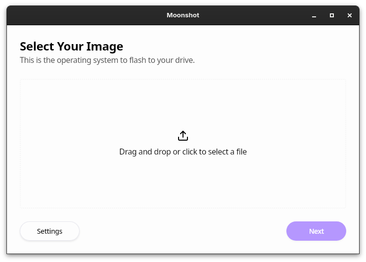

# 🌙 ☄️ Moonshot

A beautiful cross-platform flashing tool.

## Why?

- Community frustration with existing flashing tools.
- We have unique ideas that we want to implement in the future, ex: selecting distro images from within the app.
- For fun.

## Installing

### Linux
Grab Moonshot from [Flathub](link)

### Windows
Get the exe file from the releases tab.

### macOS
Get the DMG from the releases tab.

## Development

You'll first need to install the following dependencies: `go`, `pkg-config`, and `webkit2gtk`. Install [Wails v3 Alpha](https://v3alpha.wails.io/) and [Bun](https://bun.sh), then run `wails dev` to start a development server with hot-reloading.

## Building

To build a redistributable, production mode package, use `wails build`.

## "Moonshot"?

See the Suisei song with the same title.

